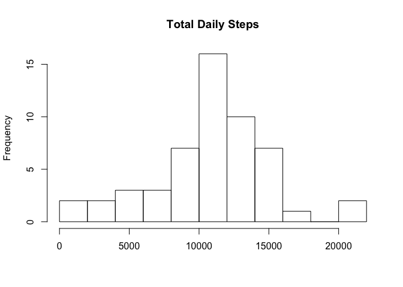
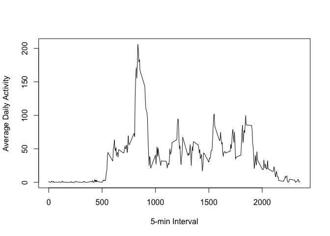
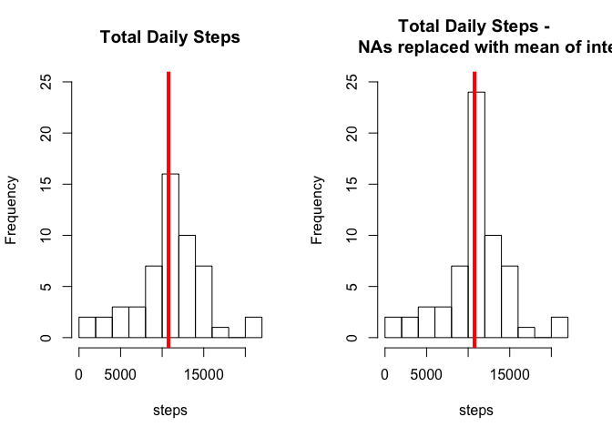
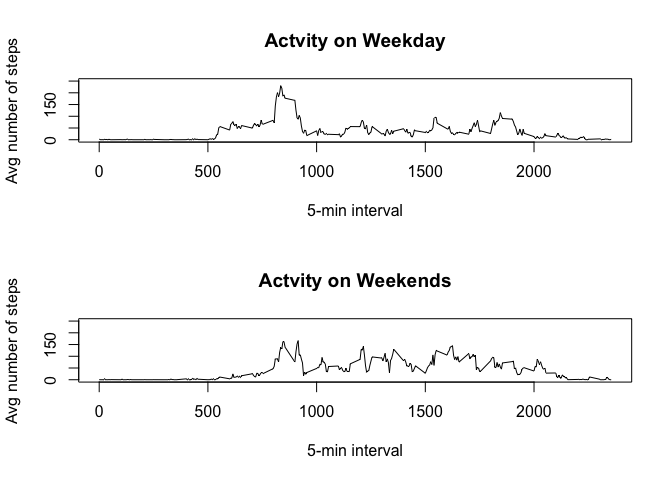

### Reproducible Research: Peer Assessment 1
#### Mojbel

echo = TRUE

## Downloading & Loading Data

```r
URL <- "https://d396qusza40orc.cloudfront.net/repdata%2Fdata%2Factivity.zip"
file <- "dataactivity.zip"
download.file(URL, file, method = "curl")
unzip(file, list = FALSE, overwrite = TRUE)
data <- read.csv("activity.csv")
```


## Converting date to Date class

```r
data$date <- as.Date(data$date)
```


## Checking and deleting NA values

```r
sum(is.na(data$steps)); data2 <- na.omit(data)
```

```
## [1] 2304
```


## Total steps per day

```r
dailysteps <- tapply(data2$steps, data2$date, sum)
hist(dailysteps, 10, main = "Total Daily Steps", xlab = "")
```

 

```r
mean(dailysteps)
```

```
## [1] 10766.19
```

```r
median(dailysteps)
```

```
## [1] 10765
```


## Average steps per 5-min interval - daily activity

```r
avgsteps <- tapply(data2$steps, data2$interval, mean)
plot(x = names(avgsteps), y = avgsteps,  type = "l", xlab = "5-min Interval", 
                                                ylab = "Average Daily Activity")
```

 


## Maximum number of steps

```r
avgsteps[avgsteps == max(avgsteps)]
```

```
##      835 
## 206.1698
```


## Imputing missing values -  using the mean of the 5-minute interval

```r
sum(is.na(data))
```

```
## [1] 2304
```

```r
dataNA <- data
dataNA[which(is.na(dataNA$steps)),1] <- 
                    avgsteps[as.character(dataNA[which(is.na(dataNA$steps)),3])]    
sum(is.na(dataNA))
```

```
## [1] 0
```


## Total steps per day

```r
dailystepsNA <- tapply(dataNA$steps, dataNA$date, sum)
```


## Comparison plot

```r
par(mfrow = c(1, 2))
hist(dailysteps, 10, main = "Total Daily Steps", xlab = "steps", ylim = c(0, 25))
abline(v = median(dailysteps), col = 2, lwd = 4)
hist(dailystepsNA, 10, main = "Total Daily Steps - 
           NAs replaced with mean of interval", xlab = "steps", ylim = c(0, 25))
abline(v = median(dailystepsNA), col = 2, lwd = 4)
```

 


## New mean & median

```r
mean(dailystepsNA)
```

```
## [1] 10766.19
```

```r
median(dailystepsNA)
```

```
## [1] 10766.19
```


## Impact on imputing data

```r
mean(dailystepsNA) - mean(dailysteps)
```

```
## [1] 0
```

```r
median(dailystepsNA) - median(dailysteps)
```

```
## [1] 1.188679
```


## Activity pattern difference between weekdays & weekends

```r
dataNA$days <- weekdays(dataNA$date) # creating new variable
dataNA$daytype <- as.factor(c("weekend", "weekday")) # creating new variable as factor
dataNA[!(dataNA$days == "Sunday" | dataNA$days == "Saturday"), 5] <- factor("weekday")
dataNA[dataNA$days == "Sunday" | dataNA$days == "Saturday", 5] <- factor("weekend")
```


## Subsetting data to weekdays & weekends

```r
wdays <- subset(dataNA, daytype == "weekday")
wends <- subset(dataNA, daytype == "weekend")
```

## Average steps per 5-min interval by daytype

```r
wdaysactivity <- tapply(wdays$steps, wdays$interval, mean)
wendsactivity <- tapply(wends$steps, wends$interval, mean)
```

## Comparison plot

```r
par(mfrow = c(2, 1))
plot(x = names(wdaysactivity), y = wdaysactivity, type = "l", xlab = "5-min interval",
     ylab = "Avg number of steps", main = "Actvity on Weekday", ylim = c(0, 250))
plot(x = names(wendsactivity), y = wendsactivity, type = "l", xlab = "5-min interval",
     ylab = "Avg number of steps", main = "Actvity on Weekends", ylim = c(0, 250))
```

 
